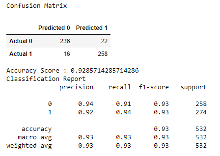

# $\color{DarkOrange}{\textsf{Net Gains - The Premier Sports Betting Predictions App}}$

## $\color{lightskyblue}{\textsf{Description}}$
This project compiles NBA regular season team data from the 2021-2024 seasons, alongside the over/under lines for each respective game within this timeframe. The over/under line, also referred to as "totals" in sports betting, represents a wager on whether the total combined score of both teams in a game will exceed or fall short of a predefined number set by the sportsbook. 

Users can select both a home team and an away team, and based on the provided over/under line, a prediction will be made for whether the total score will be over or under the set line.  

For instance, if the over/under line is established at 200.5, bettors can place a wager on whether the total points scored by both teams will be 201 or more (over) or 200 or fewer (under).

## $\color{lightskyblue}{\textsf{Visuals}}$
Model Results:  

## $\color{lightskyblue}{\textsf{How to Run the Application}}$
- Install pandas, sklearn, flask, postgresql, and sqlalchemy
- The database ERD is located in the `Database` folder titled `nba_schema.sql`
- Create a postgresql database named `nba_db` and create tables `team_data` and `over_under` located in the `data_files` folder and import the respective csv files
- Open your terminal and navigate to the repository with these files and run 'python app1.py'
- Use live server to open `index.html`
- Select a home team, away team, and an over/under line to predict then, select 'submit'
- The model will have message with the "over" or "under" prediction
- Underneath the prediction model select a team name to view the stats for the 2023-2024 regular season

## $\color{lightskyblue}{\textsf{Summary of the Model}}$
The predictive model employed in our sports betting application is a Random Forest classifier. This model provides a binary classification output of either "over" or "under" based on the selected over/under line. It achieves an accuracy of 92.8% and utilizes 1000 estimators. The model demonstrates a 94% accuracy rate for both "true positive" (under) and "true negative" (over) predictions.

## $\color{lightskyblue}{\textsf{Authors}}$
[David Avellaneda](https://github.com/davellaneda24), [Rayon King](https://github.com/rayonking123), [Latasha Jones](https://github.com/Latashajd40), [Ben Tokarczyk](https://github.com/tokarczykbl)

## $\color{lightskyblue}{\textsf{Data Sources}}$
- https://the-odds-api.com/
- https://rapidapi.com/api-sports/api/api-nba/

